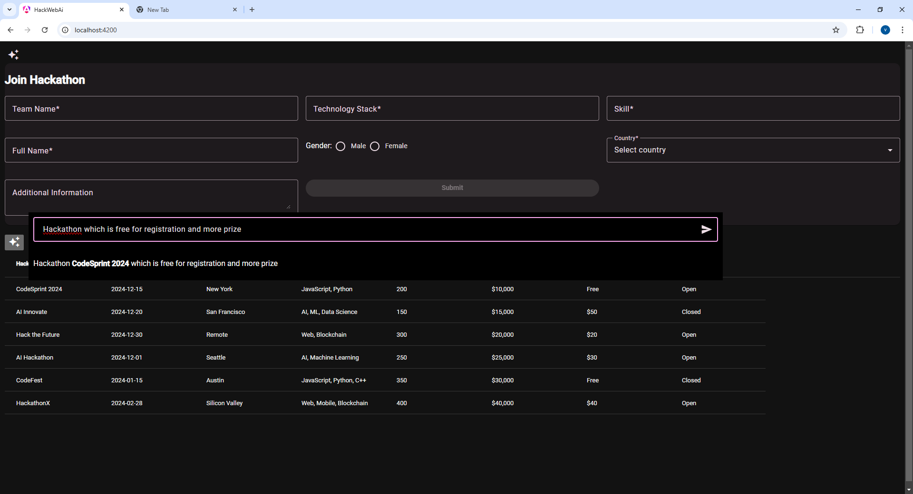
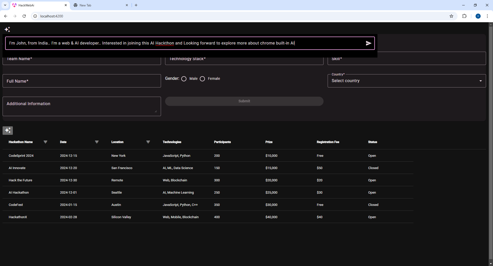

# HackWebAi

**Chrome-Built AI APIs for Real-World Web Applications**

This project demonstrates how to integrate Chrome-Built AI APIs into real-world web applications.

## Objective

The goal is to bring AI-enhanced experiences to the user interface (UI) without disrupting the familiar user experience. Many users are accustomed to the standard behaviors of web applications, such as forms, buttons, tables, and charts. Altering these experiences overnight can create confusion and difficulties.

## Solution

This solution aims to assist users with filling out forms and reviewing them using natural language. It leverages AI to enhance user interaction without requiring drastic changes to the existing interface.

Most applications present data in forms like tables, key-value pairs, or charts for visualization. However, explicit coding is often required to customize these elements differently. 

### Example Use Case

Consider a hackathon registration form with two columns: one for free registration and another for prizes. By using the Built-In AI API, users can interact with the form using natural language, making it easier to fill out without complex customization.

Similary Joining the hackathon can be done with natural lanuage and summarizer API can help reviewing the form. 

## Running this application
```
npm i
npm start
```


